# DataPilot

**用自然语言完成数据分析，让结论有据可查，让过程清晰可见。**

DataPilot 是一个可本地部署的 AI 数据分析工作台。连接 MySQL 或导入 CSV、SQLite，用自然语言发起查询、统计和可视化，生成表格、图表与分析报告，并在同一会话中继续追问。

通过 DataLink 数据地图查看业务概念与表字段的对应关系，通过回答中的引用核对查询依据，通过运行检查台查看工具调用、执行关系和事件明细。

**自然语言分析 · DataLink 数据地图 · 正文证据引用 · 可视化执行检查 · 表格、图表与报告**

在电商演示数据源中，输入一个问题：

> 对比 2025 年和 2026 年各月销售额：统计两年每月的销售总金额，用柱状图展示每月销售额，并指出同比差异最大的月份。

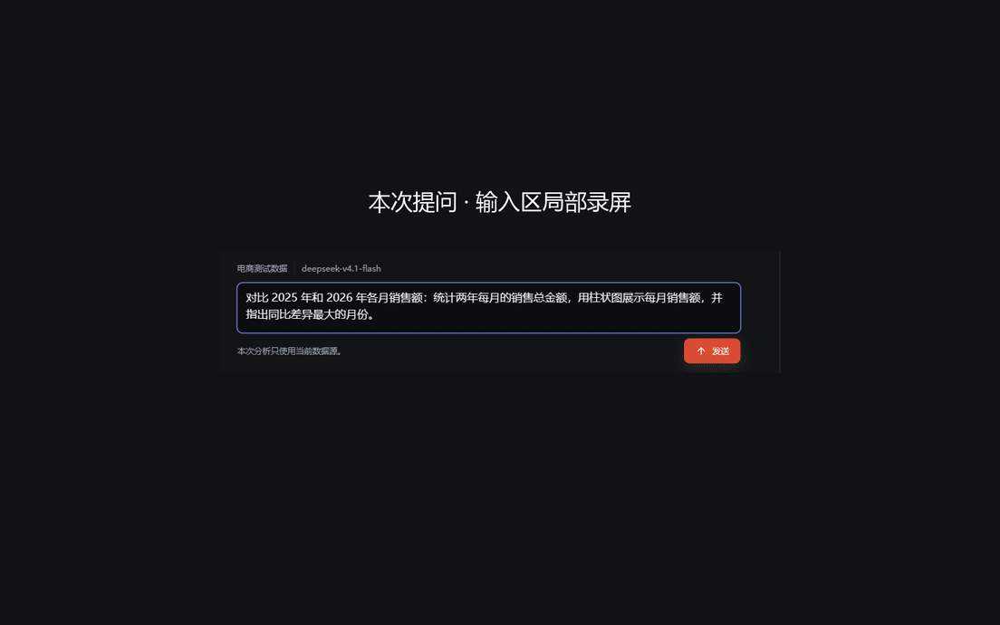

演示数据中的 2026 年仅覆盖 1–9 月；同比比较限于两年都有数据的月份，可比区间内销售额差异最大的是 3 月。打开表格、图表和正文引用，可以核对这些结果。

[快速开始](#快速开始) · [核心能力](#核心能力) · [正文引用](#从正文引用回到查询依据) · [DataLink](#datalink让字段和关系可理解) · [运行检查台](#运行检查台看见实际执行) · [基准评测](#基准评测)

<details>
<summary>查看工作台静态总览</summary>

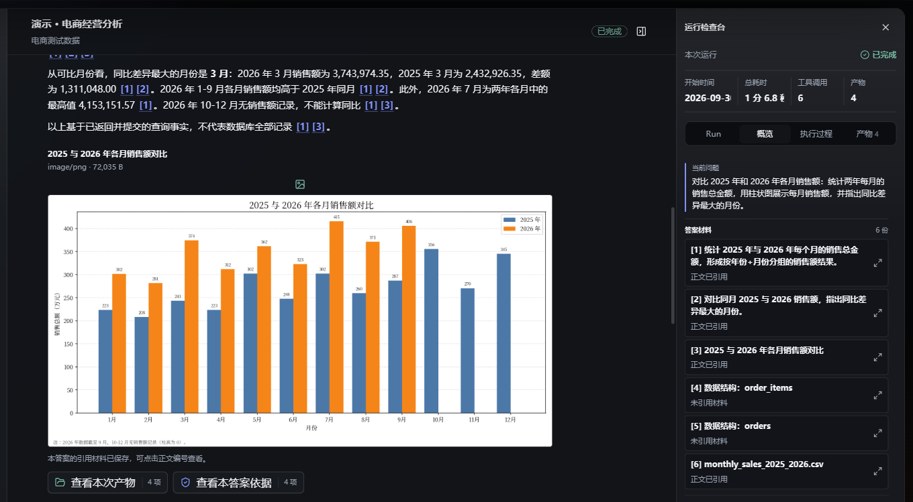

*中间阅读回答与图表，右侧打开运行检查台，核对当前运行与答案材料。*

</details>

## 核心能力

| 能力 | 你能完成什么 |
| --- | --- |
| 自然语言分析与追问 | 查询、统计、比较和绘图，在同一会话继续提问，查看表格、图表、报告或下载文件 |
| 正文证据引用 | 从回答中的编号进入材料快照，再查看来源 SQL、审计状态和完整查询结果 |
| DataLink 数据地图 | 从实体、业务属性找到物理字段，检查关系来源、候选 Join 与核验记录，维护语义说明 |
| 可视化执行检查 | 用阶段列表、执行关系图和事件明细定位工具调用、查询与产物，回放历史 Run |
| 受控工具执行 | 在只读 SQL、显式字段遮蔽和隔离 Python 的边界内完成分析，保留查询审计与产物来源 |

## 一次分析怎样完成

1. **准备数据**：接入 CSV、SQLite 或 MySQL，完成 Schema 验证并保存遮蔽清单；没有需要遮蔽的字段也要确认空清单。
2. **按需建图**：需要业务语义与关系依据时，手动建立 DataLink。上传不会自动建图，没有图谱也能分析。
3. **提出问题**：选择数据源、创建会话（Session）。每次提问或追问形成一次独立运行（Run），模型按需调用 SQL、Python 或可用的 DataLink 检索。
4. **查看产出**：阅读带引用的回答，浏览分页表格、PNG / SVG 图表、Markdown 报告，或下载已登记文件；执行中可以取消。
5. **核对与回放**：从正文引用检查查询依据，从运行检查台查看执行记录，也可以切换历史 Run 回看结果。

<details>
<summary>查看数据源准备界面</summary>

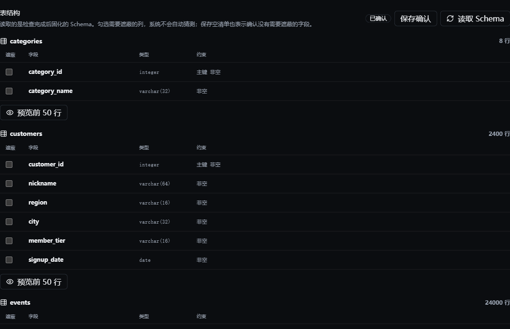

*在 Schema 字段目录中查看类型和约束，勾选需要遮蔽的字段并保存确认。*

</details>

## 从正文引用回到查询依据

回答以 Markdown 展示，正文中的编号引用可以直接打开**这次回答生成时的材料快照**，再继续检查来源查询或产物。

例如，在「演示 · 电商经营分析」会话里追问：

> 钻石会员和普通会员的平均评分差距是多少？

该次回答给出钻石会员平均评分 **4.1962**、普通会员 **4.1219**，差距为 **0.0743**。下面的引用与运行检查台截图来自这次评分分析。

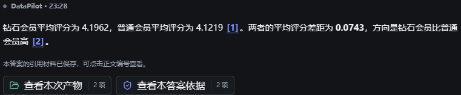

*点击结论旁的 `[1]`、`[2]`，进入对应材料，核对均值与差距的来源。*

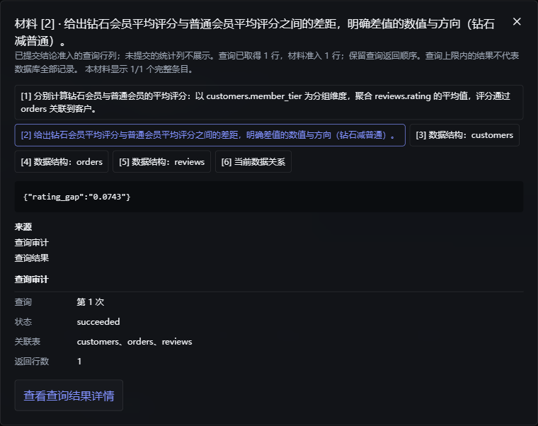

*材料 `[2]` 展示当次回答使用的 `rating_gap=0.0743`，同时提供准入范围、来源审计和查询详情入口。*

查询行列经过证据准入后成为编号材料；材料窗口显示模型收到的范围，来源详情提供查询结果，方便逐步核对。

<details>
<summary>展开材料来源的完整查询结果</summary>

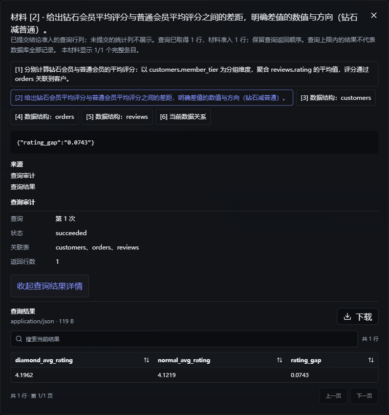

*完整表格包含 `diamond_avg_rating`、`normal_avg_rating` 和 `rating_gap` 三列；对照上方快照，可见材料 `[2]` 仅准入了差值列。完整结果仍受查询行数限制。*

</details>

## DataLink：让字段和关系可理解

DataLink 是独立的语义地图服务。它把表与字段组织成业务实体、属性和关系，让用户和 Agent 能从业务语言找到物理字段，而不只面对列名和类型。

| 工作区 | 可以做什么 |
| --- | --- |
| 字段说明书 | 按表浏览字段、业务属性、说明和所属实体，进入详情或快速编辑说明 |
| 业务属性 | 查看属性含义、所属实体与映射的 `表.字段`，对应业务概念和数据位置 |
| 关系 | 查看关系来源、置信度、候选 Join、人工状态和已有核验结果 |
| 语义地图 | 搜索实体或属性，筛选、聚焦和全屏浏览，查看选中节点的物理字段映射 |
| 草稿与发布、版本 | 人工修订、查看差异和版本记录，发布新的不可变快照 |
| 载荷预览 | 查看检索返回的语义材料，检查可传递给 Agent 的字段与关系上下文 |

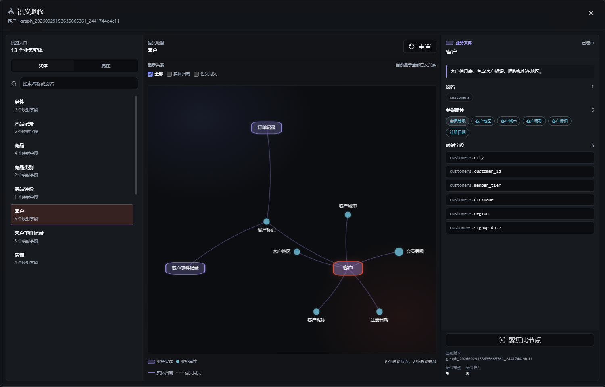

*全屏浏览实体与业务属性，选中「客户」后，在右侧查看它对应的物理字段。*

<details>
<summary>查看字段映射与检索载荷</summary>

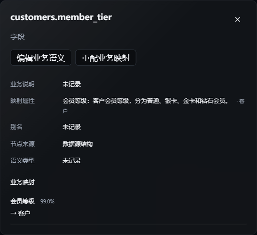

*字段详情把业务属性、所属实体与物理字段放在一起，便于检查映射并人工修订说明。*

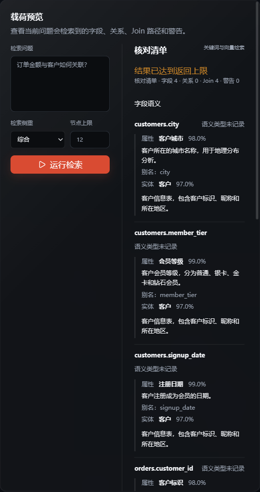

*输入「订单金额与客户如何关联？」预览检索载荷。画面显示返回了 4 个字段、4 条 Join 路径；具体路径需要继续向下浏览。*

</details>

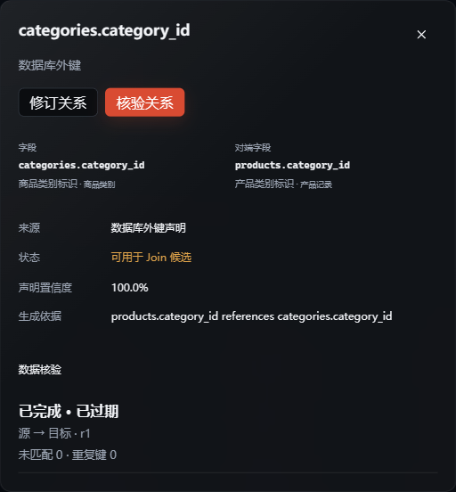

*在关系详情中查看数据库外键来源与核验状态；这条关系带有过期记录，核对时需要留意其有效性。*

<details>
<summary>查看关系核验与图谱版本历史</summary>

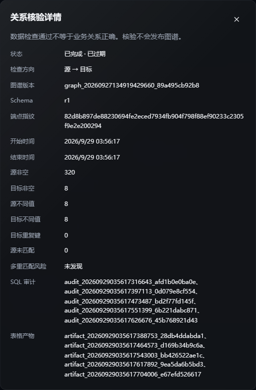

*查看非空键、重复键、未匹配与多重匹配检查，并同时核对过期标记。核验与图谱发布是独立操作。*

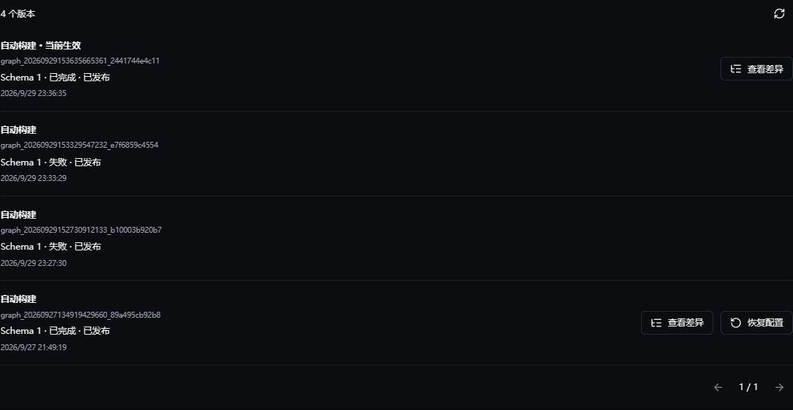

*版本列表区分当前发布、可恢复历史和失败记录，便于核对当前使用的快照与历史构建状态。*

</details>

人工编辑先保存草稿，发布后生成可供新 Run 使用的不可变版本。你可以查看版本差异，或确认后恢复历史版本。

## 运行检查台：看见实际执行

同一 Run 可以从三种视角检查：**阶段列表看流程，关系图看记录之间的关联，事件明细看发生顺序。**

检查台保留运行状态、耗时、工具与产物概览。执行过程可以在阶段列表和关系图间切换；点击 SQL、Python 或产物节点查看详情，下方事件明细按序号列出工具活动、结果和终止记录。

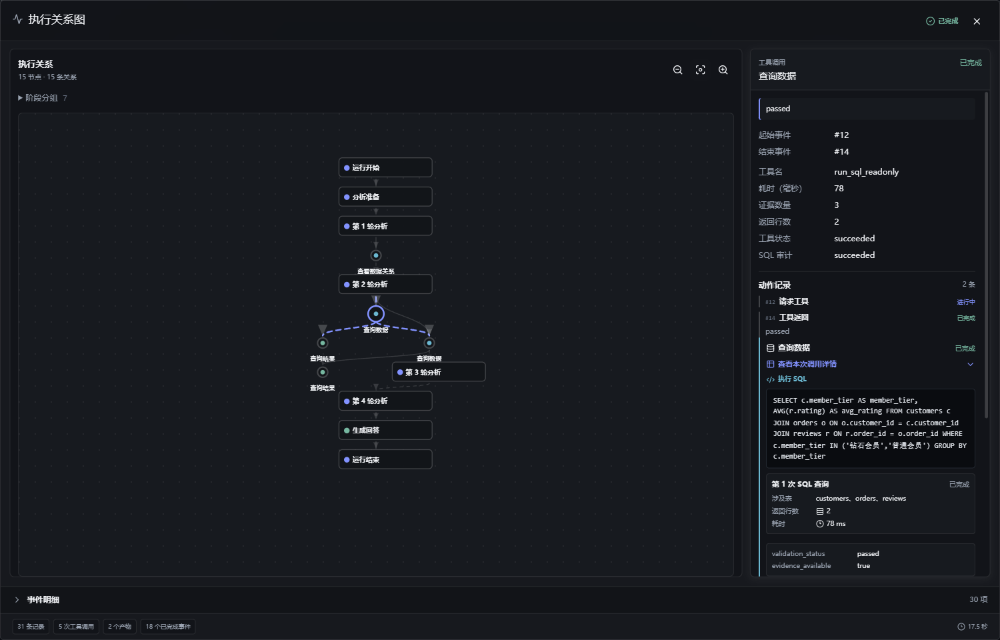

*全屏放大评分分析的执行关系图，选中节点后在侧栏查看状态与关联详情。只展示该 Run 实际存在的记录。*

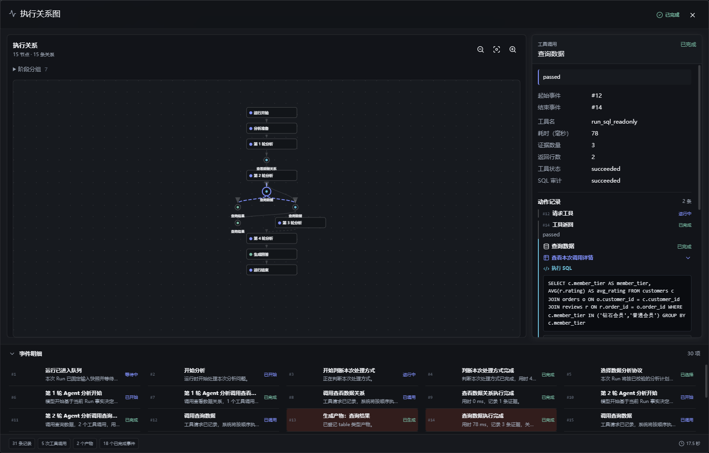

*在同一 Run 的事件明细中选择工具调用，定位对应 SQL 节点，核对请求、结果与完成状态。*

<details>
<summary>查看阶段列表、SQL 详情与事件近景</summary>

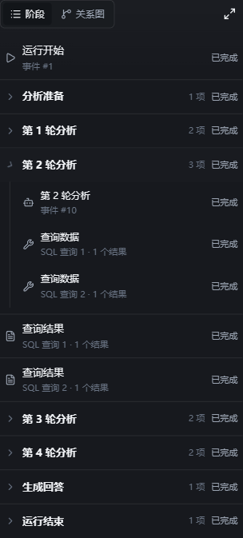

*展开准备、Agent 回合、数据工具和最终回答，沿阶段检查本次运行的实际状态。*

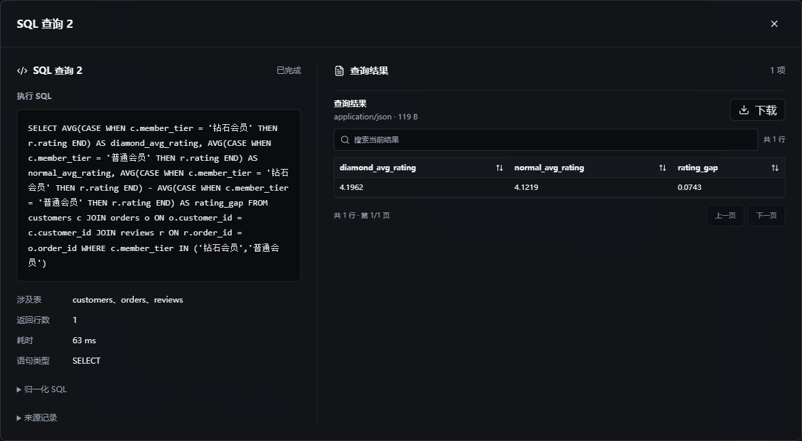

*左侧核对实际 SQL，右侧核对两组均值与差值的完整表格；这次查询对应正文材料 `[2]`。*

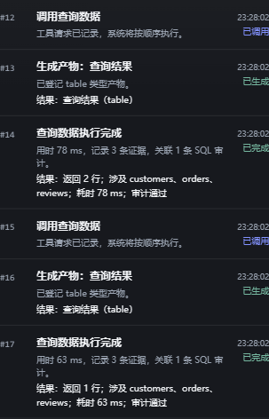

*`#12–#14` 对应返回 2 行的均值查询，`#15–#17` 对应返回 1 行的差值查询。按序号区分两次调用与各自的结果登记。*

</details>

## 快速开始

以下是 **Windows + PowerShell 7** 的本地开发路径。准备 Python 3.12、uv、Node.js 22.12+ 与 npm；运行 Python 计算、绘图或报告还需可用的 Docker。

### 1. 安装与配置

```powershell
git clone https://github.com/w402116500/DataPilot.git
cd DataPilot
uv sync
npm ci
Copy-Item -LiteralPath .env.example -Destination .env
```

编辑 `.env`，设置至少 16 字符的独立随机 `SECRET_MASTER_KEY`；它用于加密保存的凭据，不是模型 API Key，不要提交 `.env` 或密钥。

DataLink 建图可选：需要建图时填写 `DATALINK_LLM_MODEL`、`DATALINK_LLM_BASE_URL`、`DATALINK_LLM_API_KEY`。它们不配置主 Agent；不建图可以先留空，embedding 也不是必需条件。

### 2. 启动服务

```powershell
uv run alembic upgrade head
pwsh -File scripts/dev-services.ps1 -Action Start
```

| 服务 | 本地地址 |
| --- | --- |
| Web 工作台 | `http://localhost:5175` |
| 主后端 API | `http://localhost:8011` |
| DataLink REST / MCP | `http://localhost:8100` / `http://localhost:8100/mcp` |

```powershell
pwsh -File scripts/dev-services.ps1 -Action Status
pwsh -File scripts/dev-services.ps1 -Action Stop
```

脚本使用 Windows 虚拟环境路径，统一管理 Web、API 和 DataLink；主后端按单 Worker 运行。

### 3. 配置分析模型与数据源

打开顶部「模型设置」，新增主 Agent 的 OpenAI-compatible 模型，填写模型名、Base URL 和 API Key，执行「测试配置」后「激活」。模型需要支持原生工具调用；测试和实际分析会调用模型服务，可能产生费用。

随后接入数据源，完成 Schema 验证与遮蔽确认，回到工作区创建 Session 并提问。可以用仓库里的 `data/demo/ecommerce.sqlite` 或 `data/demo/ecommerce_flat.csv` 体验接入；这些小型 Demo 不等同于本文截图或基准评测的数据集，不能据此复现相同数值。

### 4. 启用 Python 沙盒

需要计算、绘图或报告时，先启动 Docker 并构建与 `.env.example` 中 `SANDBOX_IMAGE` 一致的镜像：

```powershell
docker build -f apps/api/sandbox/Dockerfile -t datapilot-analysis:0.1.0 .
```

只有需要 Python 的 Run 才按需启动沙盒；SQL 查数不要求先执行 Python。

## 准确性与使用边界

- **答案与材料**：正文引用只检查编号是否存在，不验证语义或数值正确；查询全结果与模型准入材料可能不同。证据不足或目标未完成会显示为不完整分析，仍需结合材料核对结论与口径。
- **语义与版本**：候选关联和数据核验不能证明业务 Join 正确，需关注失败、未核验和过期状态；载荷预览也不证明模型实际采用了它。Run 启动时固定 Schema 与图谱版本，后续发布或重建不改历史 Run。
- **SQL 与遮蔽**：查询统一通过 Data Gateway，执行表字段白名单、AST 只读检查、结果限制和 SQL 审计。用户显式确认的 `mask_fields` 作用于预览、SQL 结果、SQL 表格产物与模型观察，系统不自动识别敏感字段。
- **Python 与产物**：Python 在每次 Run 专属的无网络 Docker 沙盒中读取该轮只读输入；仅登记已声明、真实生成且通过路径、类型和大小等安全检查的文件。Python 输出可能包含原始业务值，**不自动脱敏**。
- **追问与执行记录**：近期消息和安全摘要帮助理解追问，不充当数据事实；换数据源后新 Run 不沿用旧数据源结论。阶段、图与事件是持久化执行事实，不是模型隐式思维链；历史回放不重新调用模型或工具，失败尝试仍保留。连续回答片段仅在展示层合并，原始事件不丢弃。
- **模型与部署**：可本地部署不代表模型离线。主 Agent 与 DataLink 使用你配置的模型服务；DataLink 建图模型可以使用字段样例和统计，包括配置为遮蔽的字段，需确认数据授权与发送范围。开发脚本的 Web / API 监听所有网卡，请将服务限制在可信本地网络。

## 架构概览

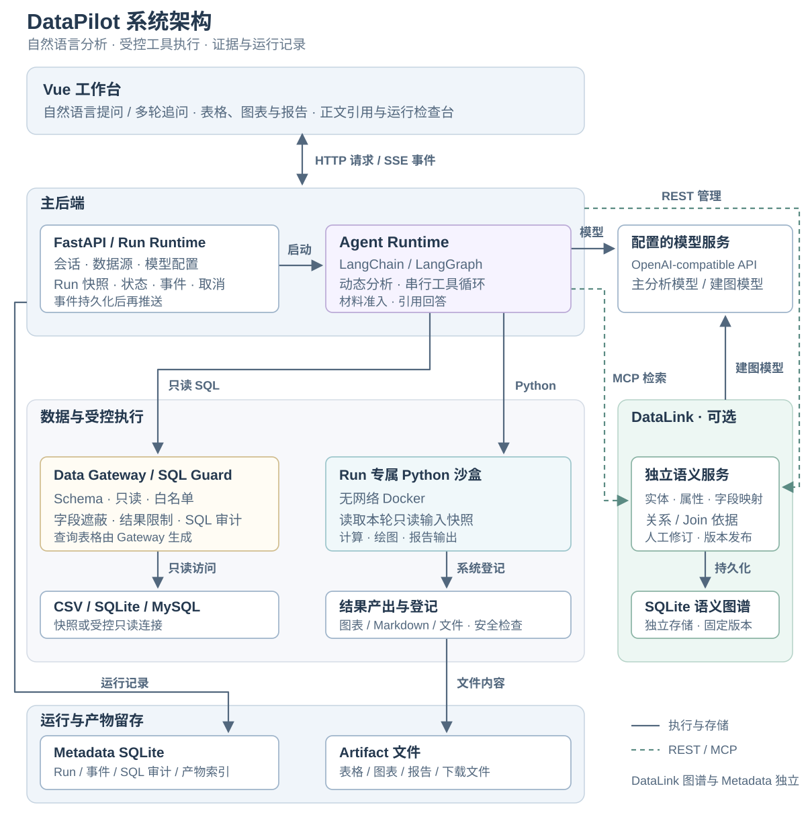

主后端管理会话与 Run，Agent 根据问题动态选择工具；SQL 通过 Data Gateway 查询，Python 在本轮沙盒中计算，可选的 DataLink 提供独立语义检索。运行记录与产物索引保存到 Metadata，产物内容保存为文件；图中虚线标出 DataLink 的 REST / MCP 协议边界。

Web 使用 Vue 3、TypeScript、Pinia、shadcn-vue / Tailwind CSS 和 ECharts；主后端使用 Python 3.12、FastAPI、Pydantic 与 SQLAlchemy。DuckDB / sqlglot 支撑数据访问与 SQL 检查，DataLink 通过独立 REST / MCP 边界提供语义增强。主后端 Metadata 与 DataLink 图谱分别使用独立 SQLite 存储。

## 基准评测

仓库包含 **20 题中文电商基准**，提供普通题面、强调 DataLink 的题面、标准答案和逐题评分脚本。题库结构可以离线检查，不调用模型：

```powershell
uv run python scripts/score_benchmark.py --lint
```

要跑真实评测，需先准备与标准答案一致的被测数据、已激活模型和已确认遮蔽的数据源；DataLink 题面还需相应已发布图谱。题库不包含当时的完整被测数据副本，内置小型 Demo 不能替代它。

下面的驱动会创建会话并调用真实模型，**会产生运行记录和可能的模型费用**。把页面中的数据源 ID 填入变量，再运行：

```powershell
$datasourceId = "替换为被测数据源ID"
uv run python scripts/run_benchmark.py --datasource-id $datasourceId --questions data/benchmark/ecommerce-cn/questions-datalink.jsonl --out-dir .tmp/benchmark-runs/my-run
uv run python scripts/score_benchmark.py --bench-dir data/benchmark/ecommerce-cn .tmp/benchmark-runs/my-run
```

驱动保存回答、事件、工具调用、审计、产物与运行状态；评分器使用标准答案的单元格匹配、数值相对容差（0.05%）和小数位舍入，输出逐题 verdict。它不是语义评审器，也不检查全部解释、排序或图表质量，`correct` 不表示整份分析绝对正确。

## 仓库导航

| 路径 | 内容 |
| --- | --- |
| `apps/web` | Vue 工作台、数据源管理与模型配置 |
| `apps/api` | FastAPI 主后端、运行生命周期与适配装配 |
| `packages` | Agent Runtime、共享契约、Data Gateway 等核心包 |
| `services/datalink` | 独立语义地图服务与版本化图谱 |
| `data/demo` | 接入演示用的小型 CSV / SQLite 数据 |
| `data/benchmark` | 公开题库、标准答案与题库维护说明 |
| `scripts` | 本地服务管理、基准驱动与评分器 |
